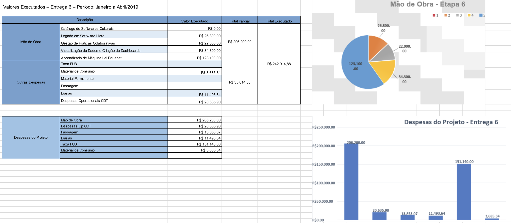

# Introdução

O presente relatório apresenta o acompanhamento do trabalho realizado no
projeto "Ecossistemas de Software Livre", Termo de Cooperação para
Descentralização de Crédito, Processo Ofício No 0646/2017/FUB-UnB, Vigência
Outubro 2017 à Outubro 2019. O relatório apresentado é referente aos avanços
realizados na Etapa VII (Fevereiro 2019 à Abril 2019), de acordo com o cronograma
do Plano de Trabalho.

Toda alteração no cronograma proposto foi realizada  a partir de renegociação
com a CGTEC do Ministério da Cultura, e tais alterações estão descritas no
relatório.
O presente relatório apresenta o acompanhamento do trabalho realizado no 
projeto "Ecossistemas de Software Livre", Termo de Cooperação para
Descentralização de Crédito, Processo Ofício No 0646/2017/FUB-UnB, Vigência
Outubro 2017 à Outubro 2019. O relatório apresentado é referente aos avanços
realizados na Etapa VII (Fevereiro 2019 à Abril 2019), de acordo com o cronograma
do Plano de Trabalho.

Toda alteração no cronograma proposto foi realizada  a partir de renegociação
com a CGTEC do Ministério da Cultura, e tais alterações estão descritas no
relatório.

Todas as frentes contempladas no plano de trabalho no período foram aplicadas em dois principais produtos desenvolvidos no laboratório: o salic-ml e a Tais.

## FASE DE PLANEJAMENTO/EXECUÇÃO

O período de fevereiro 2019 à abril 2019 contemplou as fases de
planejamento e execução. Abaixo serão apresentados, brevemente, os principais
avanços alcançados no período. Toda a documentação e acompanhamento do projeto
está disponibilizado e pode ser acessado na organização do laboratório
[lappis-unb](https://github.com/lappis-unb), e no
repositório específico do projeto
[lappis-unb/EcossistemasSWLivre](https://github.com/lappis-unb/EcossistemasSWLivre).
Todo o planejamento e execução das tarefas podem ser acompanhados tanto nas
_issues_ quanto nas páginas _wiki_.

Abaixo serão apresentados os principais avanços alcançados no período, por
pacote de trabalho (de acordo com o Plano de Trabalho),
de acordo com o cronograma, no período citado.

------

# Chatbot Tais

## Objetivos

## Funcionalidades

# SALIC-ML

## Objetivos

## Avanços/Resultados

# Visualização de dados e criação de Dashboards 

## Objetivo

## Atividades realizadas

### Práticas de gestão colaborativa <!-- {{{ -->

O objetivo de estudar os movimentos, organizações, desenvolvedores e demais stakeholders que atuam na gestão colaborativa de software livre é manter um conjunto de ações de governança digital e comunicação que aproveite ao máximo esse potencial em favor das necessidades do órgão e das metas comuns às organizações parte das comunidades. Esse esforço envolve um trabalho de mapeamento de atores de cada comunidade (atuais e potenciais futuros), assessoria para planejamento conjunto, facilitação de fluxos de comunicação e mobilização, realização de atividades conjuntas para integração, identificação de oportunidades externas, assessoria para comunicação e divulgação ao público externo à comunidade e apoio para solução de conflitos.

As ações realizadas  nesta etapa para atender os objetivos do plano de trabalho foram:

- [x] Reuniões contínuas com os parceiros

<!-- }}} -->

# Acompanhamento Financeiro

# Assinatura

Responsável pela Execução:
---
Nome:  Carla Silva Rocha Aguiar
             (Coordenadora do Projeto)

Assinatura: 

Data: 28/01/2019

# Anexo 1 
