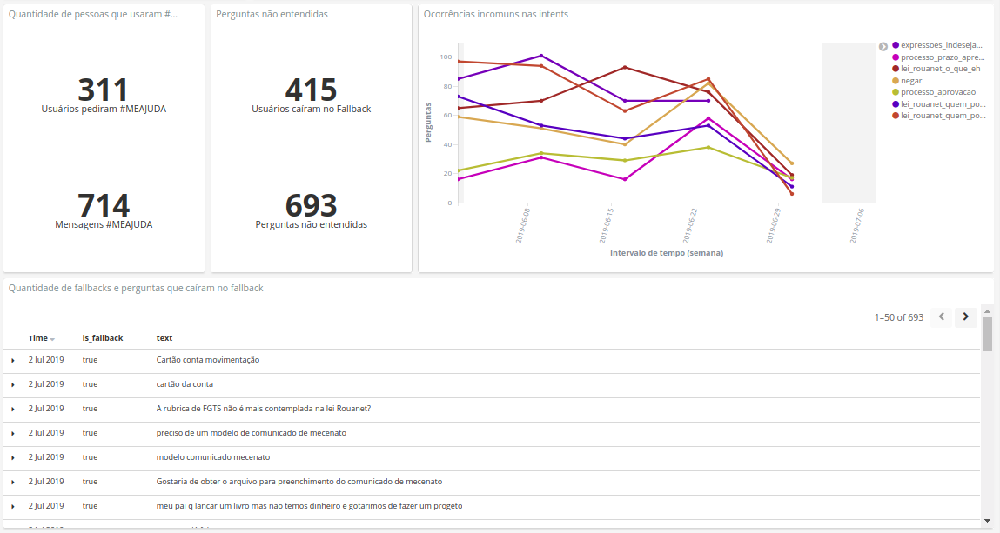
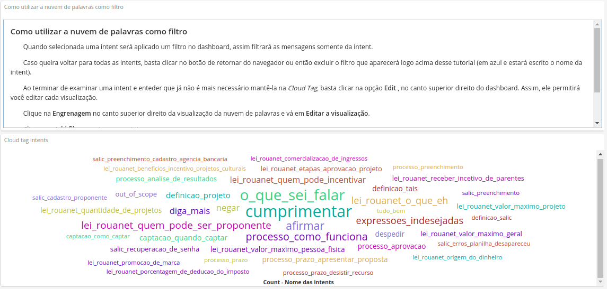

### Dashboards BI Tais

O Dashboard (Perfil de usuário) de acompanhamento de uso da Taís que continha as métricas de negócio (Usuários por dia, usuários e mensagens por semana, total de usuários, média de perguntas por usuário, perguntas mais frequentes, quantidade de pessoas que usaram #MEAJUDA, tendências de intents) foi aprimorado com novas visualizações:

- Ocorrências incomuns nas intents
- Quantidade de _fallbacks_ e perguntas que caíram no _fallback_

Foi disponibilizado um novo _dashboard_ para fazer o acompanhamento mais técnico e auxiliar no aprimoramento dos fluxos já existentes ou na criação de novos fluxos, amparando a evolução do chatbot e o trabalho dos designers de conversação.

Esse novo painel possui primeiramente um tutorial de como utilizá-lo e segue com três novas visualizações:

- Como utilizar a nuvem de palavras como filtro
- Cloud tag intents
- Perguntas dos usuários (texto das intents)
- Quantidade de _fallbacks_ e perguntas que caíram no _fallback_

Estão disponibilizados dois sites em homologação para visualização dos dashboards existentes. Houve a separação em duas aplicações para fazermos a separação de usuário. No primeiro caso (https://dados.tais.lappis.rocks) os dashboards estão disponíveis somente para a visualização. No segundo caso (https://analytics.tais.lappis.rocks) o usuário pode editar ou criar novos dashboards e visualizações.

O monitoramento da Tais em produção no período dos últimos 3 meses nos fornece as seguintes informações:
- O número médio de usuários atendidos pela Tais por dia é 43 usuários
- A quantidade de usuários atendidos por mês é cerca de 1300
- Há em média 5,5 perguntas por usuários
- 24% dos usuários usam o recurso #MEAJUDA
- As perguntas mais realizadas para a Tais são: "Como faço para submeter um projeto pela Lei Rouanet" e "Quem pode ser proponente"
- As perguntas tais como "Como aprovar um projeto?" e "Quem pode incentivar" foram umas das perguntas que obtiveram mais resultados em relação às ocorrências incomuns.
- A Tais ficou fora do ar em 1 ocasião. Houve a migração e adaptação da página para a reformada Lei de Incentivo à Cultura Isso. Essa migração é feita manualmente, assim como a inserção do _script_ com o livechat da Tais. Nesta ocasião o chatbot ficou quase 1 mês fora do ar.
